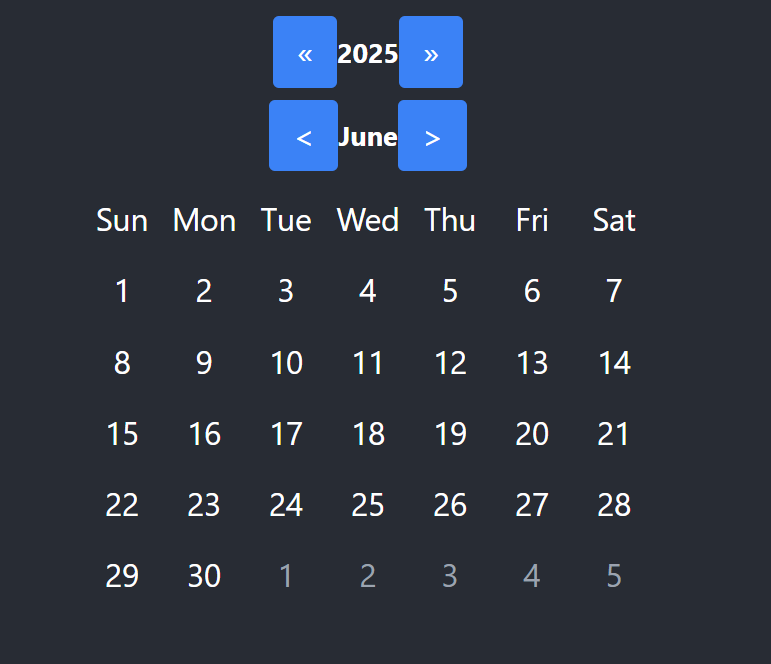
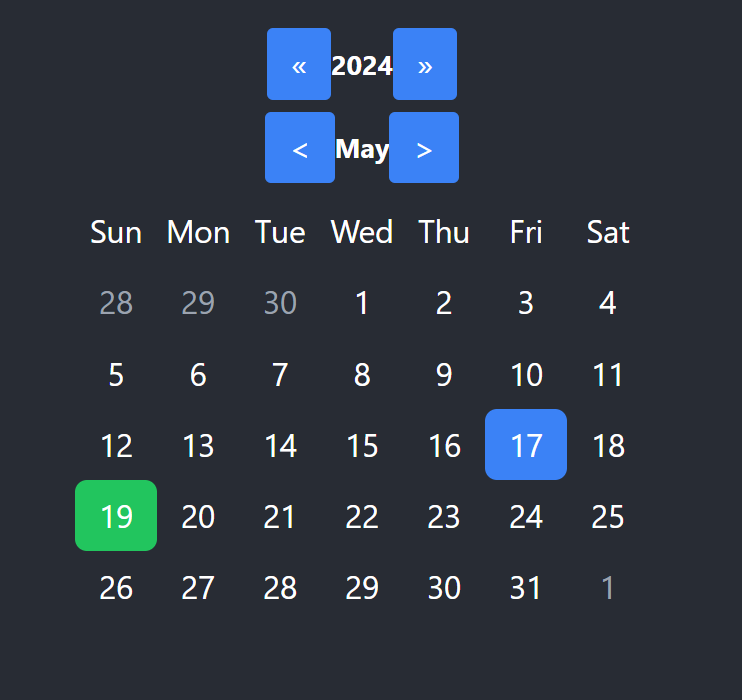
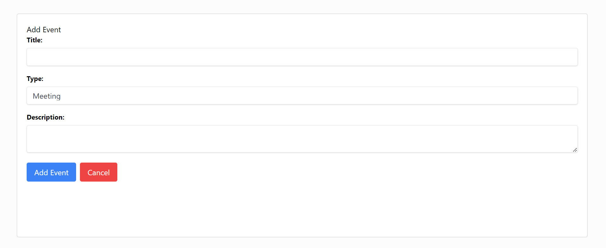
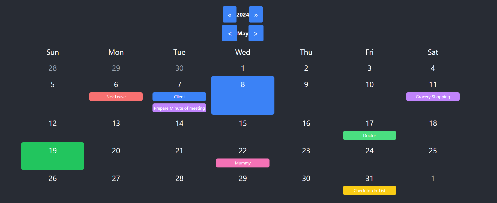
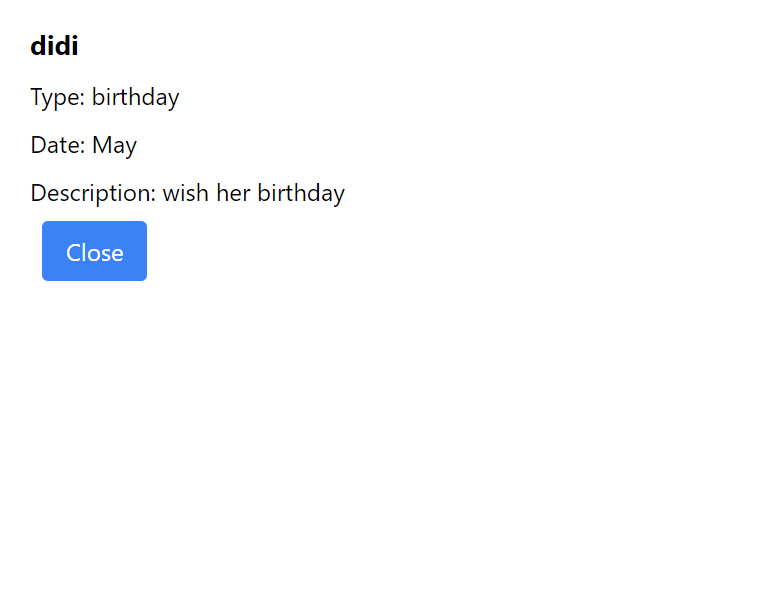
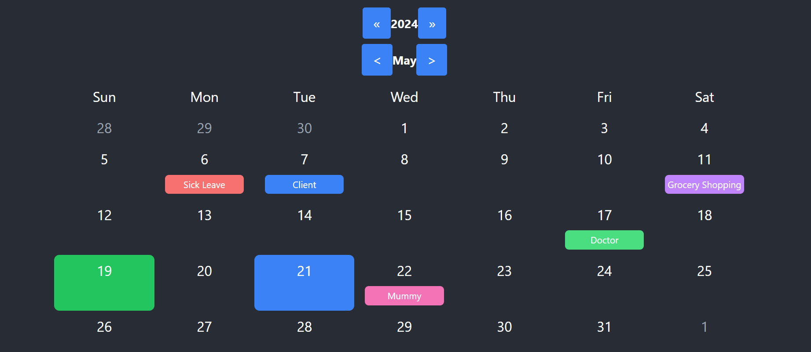

# CustomCalendar

# Features
1. Display a monthly calendar grid with customizable event markers.
2. Add events with ease.
3. View detailed event information in a pop-up modal.
4. Navigate between months and years effortlessly.
5. Responsive design for various screen sizes.

# Screenshots
.png>) 
 
 
 
 
 

# Customization
The Calendar Component is highly customizable. You can adjust the styling using Tailwind CSS classes or modify the component's behavior.

# Integration with Day.js
Day.js is integrated into the Calendar Component for robust time zone handling and date formatting. 

# Contributors
Suniti - Developer
